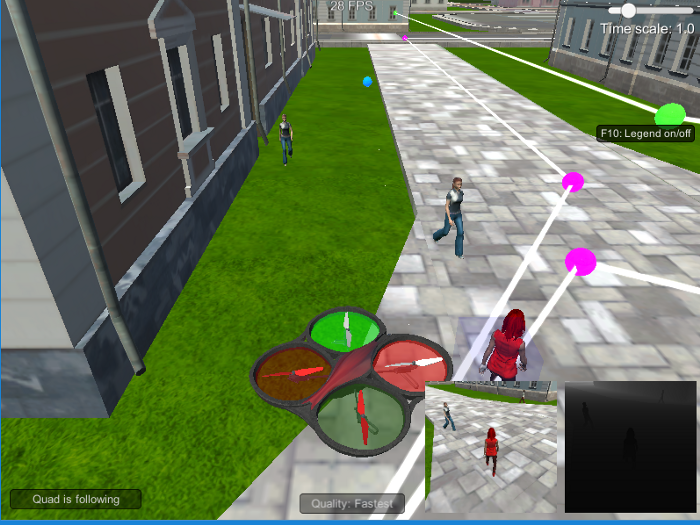
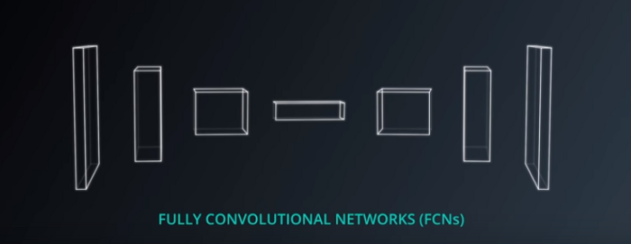
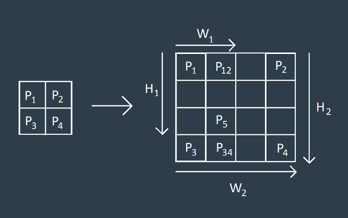
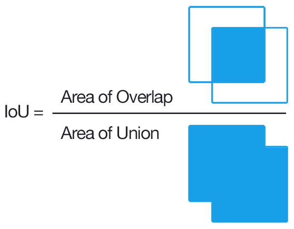
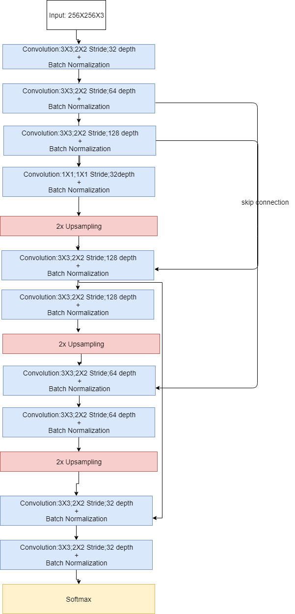

# What is follow me in robotics?

**Follow Me** is a field in robotics to identify and track a target in the simulation.

So-called “follow me” applications like this are key to many fields of robotics and the very same techniques you apply here could be extended to scenarios like advanced cruise control in autonomous vehicles or human-robot collaboration in the industry.

In [this project](https://github.com/brunoeducsantos/Follow-Me), a deep neural network was trained to identify and track a target in simulation, i.e., a person called “hero” which will be mixed with other people. In the figure below there is a representation of the drone following the “hero”.

---

## Have you heard about Convolution Networks?

Keeping in mind the concept of neural networks, there are two main advantages of using convolution networks applied to image recognition:
- Parameter sharing: a feature detector (such as a vertical edge detector) that’s useful in one part of the image is probably useful in another part of the image.
- Sparsity connections: in each layer, each output value depends only on a small number of inputs which makes it translation invariance.

Usually, convolution network architectures are structured as follows:
- [Convolution Layer](https://cs231n.github.io/convolutional-networks/#architectures)
- [Pooling Layer](https://cs231n.github.io/convolutional-networks/#architectures)
- [Fully Connected Layer](https://cs231n.github.io/#architectures)
- [Softmax](https://www.coursera.org/lecture/deep-neural-network/softmax-regression-HRy7y)

As activation function per a layer, RELU applies elementwise non-linearity. 

Even though convolution networks are the state of the art for object classification, for object detection, an architecture adjustment must be applied to provide pixelwise network learning. This architecture is so called Fully Convolution Network.

---

## What is a Fully Convolution Network ?

A Fully Convolution Network (FCN) is a network architecture that allows preserving the spatial information throughout the network, which is very neat to object detection in an image. In addition, FCN can receive an input of any dimension.

Regarding the architecture, FCN has the following architecture :
- Encoder (first 3 elements in the picture above)
- 1x1 convolution layer (4th item in the picture above)
- Decoder ( 3 last times in the picture above)
- Skip connection

The encoder corresponds to the traditional convolution network described in the previous section. Encoder allows to learn the most important features to later on upsampling and obtain object segmentation in the image.

A brand new concept is 1x1 convolution layer. In simple terms, it is a convolution layer that preserves spatial information . In addition 1x1 performs element wise multiplication and summation by applying a 1x1 sliding window over the input layers from the encoder. Finally,1x1 convolution reduces computational costs by reducing depth of encoder architecture. As an analogy, 1x1 convolution layer works like a Fully Connected Layer since combines linearly the depth layers and input a RELU , although reversely to Fully Connected Layers it preserves spatial information.

Finally, the decoder is composed by bilinear upsampling layers followed by convolution layer+ batch-normalization and skip connections with encoder layers to improve lost spatial features resolution.

Let’s break down these three important concepts:
- Bilinear upsampling
- Batch-normalization
- Skip connections

Bilinear upsampling is a resampling technique that utilizes the weighted average of four nearest known pixels, located diagonally to a given pixel, to estimate a new pixel intensity value. The weighted average is usually distance dependent.

Let’s consider the scenario where you have 4 known pixel values, so essentially a 2x2 grayscale image. This image is required to be upsampled to a 4x4 image. The following image gives a better idea of this process.

Let’s keep in mind though, the bilinear upsampling method does not contribute as a learnable layer like the transposed convolutions in the architecture and is prone to lose some finer details, but it helps speed up performance.

For instance, transposed convolutions is a method that has learnable parameters instead of interpolation. A transposed convolution is somewhat similar because it produces the same spatial resolution a hypothetical deconvolutional layer would. However, the actual mathematical operation that’s being performed on the values is different. A transposed convolutional layer carries out a regular convolution but reverts its spatial transformation.

For further detail about transposed convolution math go [here](https://arxiv.org/ftp/arxiv/papers/1609/1609.07009.pdf).

The second important concept is [batch-normalization](https://www.coursera.org/lecture/deep-neural-network/why-does-batch-norm-work-81oTm) which basically refers to normal data within the network per mini-batch of training data. This process allows the network to learn fast. In addition, it limit big changes in the activation functions inside the network, i.e., there is a more smooth and solid learning in the hidden layers.

The third important concept is [skip-connections](https://www.coursera.org/lecture/convolutional-neural-networks/resnets-HAhz9), which basically gets higher resolution from initial layers of encoder and combines with the decoder layers to get more spatial resolution lost during convolution layers . This method is important to the decoder since the upsampling doesn’t recover all the spatial information.

Finally, [skip connections](https://arxiv.org/pdf/1608.04117.pdf) are also useful to train increasing deeper networks such as ResNet architecture.

After building and training a FCN , a question arises naturally : how do we know if our object detection model is performing well? That is when Inserction Over Union(IoU) metric comes handy. In the next section we will discuss about this concept and why is a good metric for object detection performance.

---

## What's about IoU?

IoU measures how much the ground truth image overlaps with the segmented image resulting from our FCN model. Essentially, it measures the number of pixels inserction over pixel union from groundruth and segmented images FCN network. So, the metric mathematically formulation is :

Now you are wondering, what about your model? What were the hurdles ? Which were the end results? Let’s talk about it in the next section.

---

## What about the great project?

This project was divided into three main stages:
- Generate and pre-process the images from the simulator
- Design the model architecture
- Train and scoring the model

The preprocessing step transforms the depth masks from the sim, into binary masks suitable for training a neural network.

The final model architecture visualization is:

Firstly, the use of encoder and decoders to apply segmentation of objects in a image is based on pixel by pixel learning instead of image invariance filters as used in image classification where the spatial information is not so relevant. The overall strategy for deriving a model architecture began with a base on initial convolution layer of depth 32 with 3x3 filter , 1x1 convolution with depth 8 and decoder with same depth than encoder. The reason for this start was based on image input size 256X256X3. From this point, several convolution layers were added with increasing depth (based on powers of 2). This approach was based on SegNet architecture used by Stanford to segment objects in a image. It is important to mention that the 1x1 layer depth increase was correlated with data generation to reduce overfitting and model performance improvement. The data generation was important to reduce the error (cross-entropy) of training and validation datasets as well overcome the local minimum and allow the network to continue learning.

Regarding the final score as you remember is defined by a metric called IoU, was given by 0.49. Usually, the criteria for validade a segmentation as the predicted object is >0.5. Although, for this project as a Udacity project, the criteria was lowered to 0.4.

